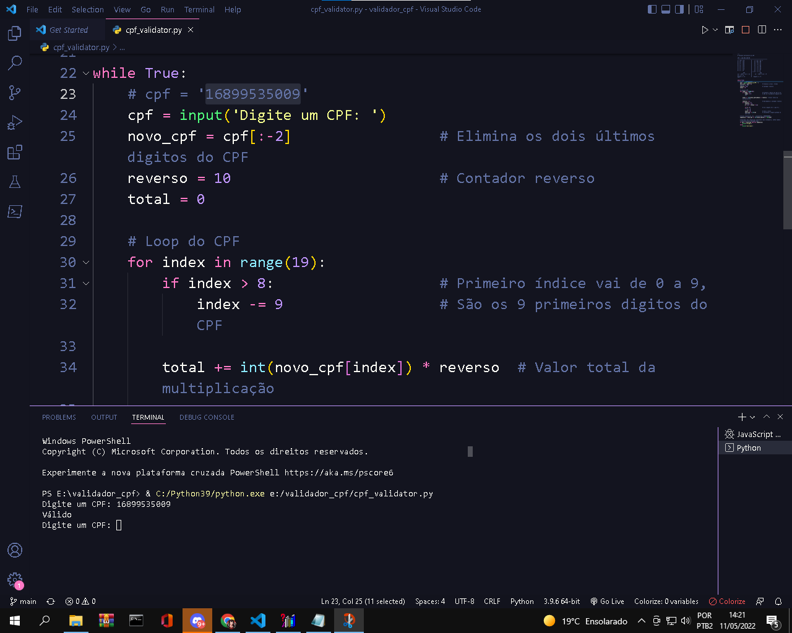

## Projeto Validador de CPF

Projeto educacional com o intuito de aprofundar os conhecimentos obtidos durante o curso de Phyton. Dentro desse projeto foi aplicado conceito de `entrada e saída de dados`, `iteração de strings`, `casting`, `loops`, `estruturas relacionais` e muito mais.
  